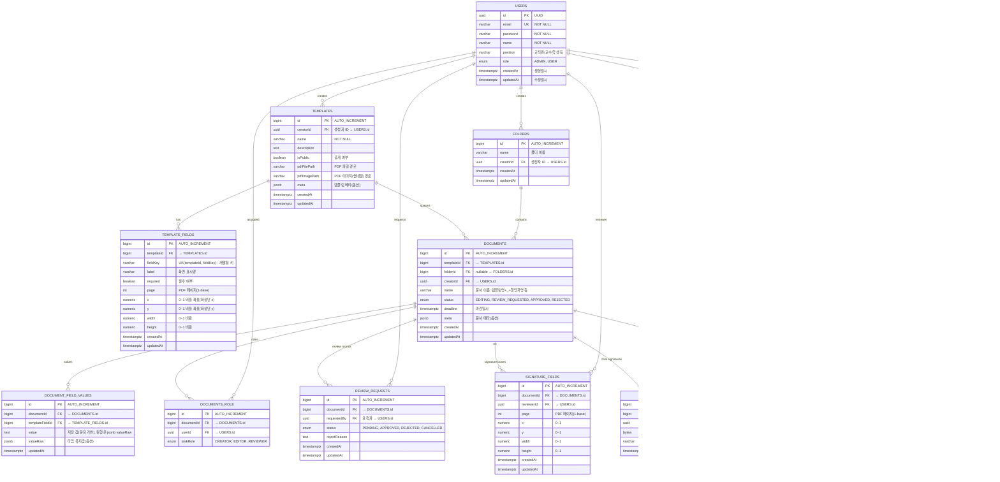

# 공동 문서 작성 플랫폼 PRD

## 1. 개요
대학 근무일지 작성 프로세스를 온라인화하는 플랫폼.  
PDF 템플릿 기반 문서 편집, 검토, 승인(서명) 기능을 제공하며, 모든 작업 과정이 기록·추적 가능.

---

## 2. 주요 사용자 유형
- **생성자(Creator)**: 템플릿을 만들고 작업을 생성하여 편집자에게 할당
- **편집자(Editor)**: 할당받은 문서를 작성 및 저장, 검토 요청 발송
- **검토자(Reviewer)**: 검토 요청 문서를 승인(서명) 또는 반려

---

## 3. 주요 기능

### 3.1 템플릿 관리
- PDF 업로드
- 필수/선택 텍스트 입력 영역 지정 (좌표, 크기, 필드명, 필수 여부)
- 템플릿 목록 조회 및 선택

### 3.2 작업 생성/할당
- 템플릿 선택 후 편집자 지정(다수 가능)
- 각 편집자별 독립 작업 생성

### 3.3 문서 편집
- 템플릿 PDF를 배경으로 표시
- 우측 패널: 필드 리스트(필수/선택 표시) + 값 입력 UI
- 저장 버튼 (필수 필드 모두 채워야 활성화)
- 미리보기 버튼
- 검토 요청 버튼 → 검토자 지정 페이지로 이동

### 3.4 검토 요청
- 검토자 검색/추가 (다수 가능)
- 각 검토자별 서명 필드 추가 가능 (문서 위에 드래그/리사이즈)
- 검토 요청 전송

### 3.5 검토/승인/반려
- 검토자는 문서 미리보기 확인
- 승인 시 서명 입력 모달 → 지정된 서명 필드에 동일 서명 자동 채움
- 반려 시 반려 사유 작성 → 편집자에게 반송

### 3.6 작업 관리/히스토리
- 자신에게 할당된 작업 및 검토 요청 리스트
- 작업 상태: 작성중 / 검토 대기 / 승인됨 / 반려됨
- 히스토리(타임라인): 작업 생성, 편집, 저장, 검토 요청, 승인, 반려 등 모든 이벤트 기록

---

## 4. 페이지 구조

| 페이지 | 주요 기능 |
|--------|----------|
| **대시보드(Main)** | - 나의 작업, 검토 요청 목록<br>- 각 작업의 현재 상태 표시 |
| **템플릿 목록(Template List)** | - 템플릿 조회<br>- 새 템플릿 추가 버튼 |
| **템플릿 생성(Template Create)** | - PDF 업로드<br>- 필드 지정(필수/선택)<br>- 필드 위치/크기 조절 |
| **작업 생성(Work Assign)** | - 템플릿 선택 후 편집자 지정<br>- 각 편집자별 작업 생성 |
| **작업 편집(Work Edit)** | - PDF 배경 + 필드 입력 패널<br>- 저장/미리보기/검토 요청 버튼 |
| **검토 요청(Review Request)** | - 검토자 검색/추가<br>- 서명 필드 추가 및 위치 조정<br>- 요청 전송 |
| **검토(Review)** | - 문서 미리보기<br>- 승인(서명 입력)<br>- 반려(사유 입력) |
| **작업 관리(Work Management)** | - 모든 작업 리스트<br>- 작업 히스토리 상세 보기 |

---

## 5. 상태 흐름 (Workflow)

```
[템플릿 생성] → [작업 생성/할당] → [편집자 작성/저장] → [검토 요청]
→ (검토자) 승인(서명) / 반려(사유) → (승인 시 완료) / (반려 시 편집자 재작성)
```

---

## 6. 데이터 구조 (예시)

### 6.1 Template
```json
{
  "templateId": "T123",
  "name": "근무일지 2025",
  "pdfUrl": "/uploads/template/T123.pdf",
  "fields": [
    {
      "fieldId": "F001",
      "name": "이름",
      "required": true,
      "position": {"x": 100, "y": 200, "width": 200, "height": 30}
    },
    {
      "fieldId": "F002",
      "name": "업무내용",
      "required": false,
      "position": {"x": 100, "y": 250, "width": 400, "height": 80}
    }
  ]
}
```

### 6.2 Work
```json
{
  "workId": "W001",
  "templateId": "T123",
  "editorId": "U101",
  "status": "editing",
  "fieldValues": [
    {"fieldId": "F001", "value": "홍길동"},
    {"fieldId": "F002", "value": "자료 정리"}
  ],
  "reviewers": [
    {
      "userId": "U201",
      "signatureFields": [
        {"x": 300, "y": 600, "width": 150, "height": 50}
      ],
      "status": "pending"
    }
  ],
  "history": [
    {"action": "create", "userId": "U101", "timestamp": "2025-08-10T10:00:00Z"},
    {"action": "save", "userId": "U101", "timestamp": "2025-08-10T10:05:00Z"}
  ]
}
```

---

## 7. ERD



